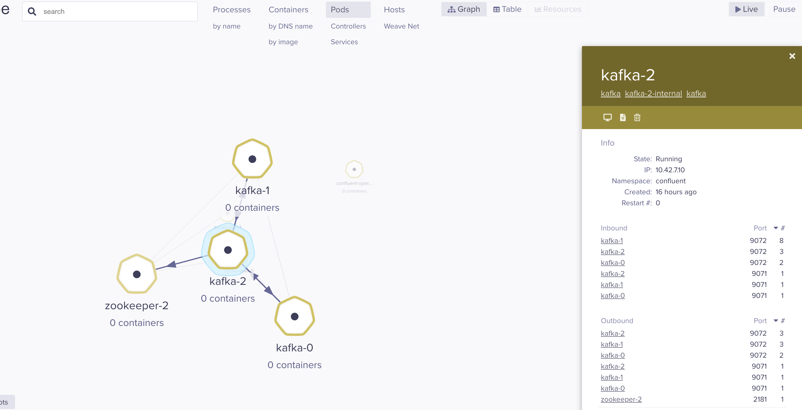

# CFK Pod Scheduling

Reduce the risk of privilege escalation attacks in your cluster by telling Kubernetes to schedule your CFK workloads on nodes with certain capabilities.

Performance does not only mean that most messages are delivered with super low-latency or super high-throughput. It also means that the performance of the cluster is constant in time and without any significant spikes.

Noisy neighbours are just one possible cause of performance issues.

## Versions

* Confluent version used: `7.3.0`

* Weave Scope version used: `v1.13.2`

## One Replica per Node

The ```oneReplicaPerNode``` property enforces to run one Pod per node through the pod anti-affinity capability, assigning a dedicated node for the pod workload.

## Taints and Tolerations

A _node taint_ lets you mark a _node_ so that the scheduler avoids or prevents using it for certain Pods.

```kubectl taint node k3d-local-cluster-agent-0 workloadType=confluent:NoSchedule```

With the following CR snippet matches the taint created above, and the pod **can be scheduled** onto the node:

```yaml
spec:
  podTemplate:
    tolerations:
    - key: "workloadType"
      operator: "Equal"
      value: "confluent"
      effect: "NoSchedule"
```

## POD Affinity & Anti-Affinity

Affinities are used to express Pod scheduling constraints that can match characteristics of candidate Nodes and the Pods that are already running on those Nodes. A Pod that has an “affinity” to a given Node is more likely to be scheduled to it; conversely, an “anti-affinity” makes it less probable it’ll be scheduled. The overall balance of these weights is used to determine the final placement of each Pod.

```yaml
    affinity:
      podAffinity:
        requiredDuringSchedulingIgnoredDuringExecution:
         - labelSelector:
              matchExpressions:
              - key: app
                operator: In
                values:
                - zookeeper
           topologyKey: "kubernetes.io/hostname"
      podAntiAffinity:
        requiredDuringSchedulingIgnoredDuringExecution:
          - labelSelector:
              matchExpressions:
              - key: app
                operator: In
                values:
                - kafka
            topologyKey: "kubernetes.io/hostname"
```

---

## Local Cluster

```sh
./start.sh 
```

###  Start Script Steps

1. Create the K3d cluster with ```3``` master nodes  

2. Create ```5``` Worker nodes  

3. Taint three nodes with ```workloadType=confluent:NoSchedule```

4. Create the ```confluent``` namespace

5. Deploy ```Confluent For Kubernetes Helm chart```.

6. Deploy Zookeeper (```./k8s/zookeeper.yaml```)

7. Deploy Kafka (```./k8s/kafka.yaml```)

8. Deploy [Weave Scope](https://www.weave.works/docs/scope/latest/installing/#k8s) to inspect inbound and outbound traffic.

   Port Forward Weave Scope to <http://localhost:4040>

   _The script will fail on this step if the pod is not ready yet. Just run the command again._

   `kubectl port-forward -n weave "$(kubectl get -n weave pod --selector=weave-scope-component=app -o jsonpath='{.items..metadata.name}')" 4040`

    

### Check the deployment status

* All pods: `kubectl get pod -A`

* Confluent Pods: `kubectl get pod -n confluent`

### Clean Up

` ./cleanup.sh `
 